# SwapHub E2E Test Plan

This is the SOURCE OF TRUTH of the expected behaviour of SwapHub. DO NOT MODIFY THE TESTS TO SATISFY THE IMPLEMENTATION UNLESS OTHERWISE STATED.

## Acceptance Standard

The suite uses risk-based coverage. It MUST prove the main user journeys and the state transitions that can lose, expose, or incorrectly match user data. Low-risk static and cosmetic branches only need smoke coverage.

A green full narrative alone is not sufficient. Critical behaviours MUST also have independently seedable scenarios so that they can run and retry without relying on an earlier test. The narrative in this document remains the full smoke scenario.

When an E2E test exposes a missing product rule, fix and review that behaviour as an explicit production change. Do not hide production behaviour changes inside E2E infrastructure.

## Scope

In scope:

- The authenticated `ui` application.
- Microsoft sign-in through the E2E auth adapter.
- Telegram linking and notifications through the E2E Telegram adapter.
- Onboarding, profile management, swap creation and editing, direct and three-way matching, request decisions, history, and authentication guards.
- Desktop Chromium and a mobile Chromium viewport for critical user flows.
- Local integration contract tests for application-owned concurrency and lock semantics.

Out of scope:

- The separate Astro landing site.
- Exhaustive testing of cosmetic variants and static content.
- Firefox and WebKit unless they become officially supported targets.
- CI workflow and merge-gate automation. The documented test commands MUST remain runnable locally.
- Retesting the internals of third-party libraries such as `@upstash/lock`.

## Suite Architecture

### Full Narrative Smoke Scenario

The course setup, onboarding, matching, direct-swap, and three-way-swap sections below form one full narrative smoke scenario. Account onboarding in this narrative MUST go through the user interface.

### Independent Critical Scenarios

Critical scenarios MUST NOT depend on the narrative or another test having completed. Each scenario MUST start from a known state and clean up or reset its state afterward. A failure in one scenario MUST NOT prevent unrelated scenarios from running.

Test-only setup APIs MAY seed prerequisite users, courses, swaps, and notifications when the behaviour under test is not onboarding itself. The user action being verified MUST still go through the public UI. Authentication and onboarding scenarios MUST use their user-facing flows.

The full narrative MAY remain serial. Independent scenarios MUST be runnable individually and safely repeatable against a freshly reset E2E environment.

## Required Coverage Matrix

| Priority | Area | Required proof |
| --- | --- | --- |
| P0 | Authentication and onboarding | Reject unsupported email domains; complete supported sign-in, Telegram linking, profile setup, and logout through the UI; enforce unauthenticated route guards; redirect already-onboarded users correctly. |
| P0 | Create a swap request | Open the normal New Swap entry point, search for and select a course, choose held/wanted indexes, submit, and observe the created request. Direct navigation to an edit URL alone does not cover creation. |
| P0 | Match discovery | Assert the exact direct and three-way match rows, participants, indexes, and availability. For ICC courses, prove cross-school users are excluded; for non-ICC courses, prove valid cross-school matches remain available. |
| P0 | File a match request | Send direct and three-way match requests through the UI and prove the exact request state and intended recipients. Duplicate submissions MUST NOT create duplicate active requests. |
| P0 | Accept and decline | Cover direct acceptance, direct decline, partial three-way acceptance, three-way decline by each role, and final three-way completion. Assert the exact state for every participant after each decision. |
| P0 | Notifications | Assert recipient, course, participant names/roles, lifecycle state, and action link. A course-code substring or generic `accept`/`decline` substring is insufficient. |
| P0 | Stale and invalid actions | Reopen accepted, declined, completed, cancelled, malformed, and expired request links. They MUST be non-actionable and show the expected terminal or invalid state. |
| P0 | Concurrency contract | Locally verify that concurrent operations for one lock ID admit exactly one owner and that a failed contender cannot release the owner's lock. Browser E2E does not claim to validate distributed-lock internals. |
| P1 | Swap validation | Reject a missing held index, held index also selected as wanted, excessive wanted indexes, and stale or invalid courses/indexes. Prove both visible validation and preserved data state. |
| P1 | Edit a swap request | Load existing values, add and remove wanted indexes, change the held index, save, and verify resulting match changes. |
| P1 | School changes | Existing requests remain visible and actionable after a participant changes school. New ICC matches obey the participant's current school. These are explicit production business rules. |
| P1 | Disable requests | Cover confirmation and cancellation with active requests, disabling with zero active requests, and Decline and Disable Course Requests. Assert request cancellation and notifications for every affected participant. |
| P1 | History and dashboard | Verify empty, pending, declined/cancelled, accepted, and completed states in History and My Swaps, including counts and swapped badges. |
| P1 | Profile and Telegram | Cover valid edits, invalid/empty/overlong/duplicate usernames, invalid school values, cancellation, and Telegram relinking. |
| P2 | Route and navigation smoke | Cover invalid course codes, `/about`, `/help`, `/tos`, primary navigation, logout, and theme switching without exhaustively testing presentation. |

## Assertion Requirements

- “Can only see” means equality with an exact normalized set of visible match rows. Counting avatars across the page is insufficient.
- Assert row composition: match type, all participants, held/wanted indexes, availability, and request status where displayed.
- Assert absence as well as presence. Unexpected users, rows, pending requests, and notifications MUST fail the test.
- Post-decision checks MUST prove the intended state transition, not use the presence of one avatar as a proxy.
- Notification assertions MUST select messages by recipient and lifecycle event and verify meaningful content plus the correct action URL.
- Prefer accessible roles, labels, and stable domain identifiers. Do not add selectors that expose implementation details solely for the test.

## Browser Coverage

Critical UI flows MUST run in both projects:

- Desktop Chromium.
- Mobile Chromium using a representative supported phone viewport.

At minimum, mobile coverage includes onboarding, normal swap creation, viewing exact matches, filing a request, and accepting or declining it. Lower-risk smoke cases may run on desktop only.

## E2E Safety Requirements

- Bind locally published application, Convex, and dashboard ports to `127.0.0.1`.
- E2E control routes MUST require a per-run secret in addition to an explicit E2E mode.
- Startup MUST reject non-local service endpoints, unsafe adapter credentials, or disagreement between server and browser E2E modes.
- E2E adapters MUST NOT contact Microsoft, Telegram, Upstash, PostHog, or another production service.
- Destructive reset/seed functions MUST NOT be available in a normal production deployment.
- Adapter selection MUST use one explicit, validated E2E mode rather than magic production credential values.
- Local adapters MUST preserve the application-level semantics relied on by tests. Where they cannot reproduce a third-party distributed guarantee, cover the application-owned contract separately and state the limitation.
- Container images MUST use pinned versions or digests so the same repository revision exercises the same infrastructure.

## Environment Setup

The local E2E environment is a disposable Docker Compose stack. Microsoft, Telegram, Upstash, and PostHog are replaced with test-only adapters; no production credentials or services are used.

| Resource | Purpose |
| --- | --- |
| `convex` | Runs the self-hosted Convex backend with an ephemeral SQLite data volume. Exposes the API and HTTP-action ports locally. |
| `app` | Runs the Next.js application in E2E mode and points browser and server requests at the local Convex backend. |
| `setup` | One-shot container that configures Convex environment variables, deploys functions, clears the database, and seeds course fixtures. |
| E2E auth adapter | Creates normal signed application sessions without contacting Microsoft; Convex JWT validation remains enabled through the app's local JWKS endpoint. |
| Telegram adapter | Replaces the real bot and records messages in a test outbox for notification assertions. |
| Lock adapter | Replaces Upstash locking with a local in-memory implementation. |
| `dashboard` | Optional Convex dashboard profile for inspecting the local database while debugging. |
| Playwright | Runs on the host against `http://localhost:3000` and drives all user-facing setup and test flows. |

### Container Setup

Prerequisites: Docker Desktop (or Docker Engine with Compose) and pnpm.

From `ui/`, create the local configuration and start the required services:

```sh
cp .env.e2e.example .env.e2e
docker compose -f docker-compose.e2e.yml up --build --wait -d convex app
docker compose -f docker-compose.e2e.yml run --rm setup
```

The `setup` container generates local auth keys, configures the Convex deployment, pushes the functions, clears existing data, and seeds the course fixtures. It must complete successfully before tests run.

Optionally start the Convex dashboard for debugging:

```sh
docker compose -f docker-compose.e2e.yml --profile debug up --wait -d dashboard
```

Verify the application is available at `http://localhost:3000`, then run the tests from the host. Tear down the environment with `--volumes` so the next run starts with an empty Convex database:

```sh
pnpm playwright test
docker compose -f docker-compose.e2e.yml down --volumes --remove-orphans
```

Lifecycle commands:

```sh
pnpm e2e:up       # Build, start, configure, and seed the environment
pnpm e2e:test     # Run the Playwright suite
pnpm e2e:down     # Stop containers and delete volumes
```

## High Level Setup

```mermaid
graph TD
    classDef person fill:#2d3748,stroke:#4a5568,stroke-width:2px,color:#fff

    subgraph CC ["Common Core"]
        direction TB
        
        Albert_CC["Albert (CCDS) [Has 1]"]:::person
        Bob_CC["Bob (NBS) [Has 2]"]:::person
        Carl_CC["Carl (CCDS) [Has 2]"]:::person
        Derrick_CC["Derrick (CCDS) [Has 3]"]:::person
        Emily_CC["Emily (MAE) [Has 2]"]:::person
        Frank_CC["Frank (MAE) [Has 2]"]:::person
        George_CC["George (SPMS) [Has 2]"]:::person
        Hellen_CC["Hellen (SPMS) [Has 2]"]:::person
        Ian_CC["Ian (SPMS) [Has 2]"]:::person
        Jack_CC["Jack (SSS) [Has 2]"]:::person

        %% Cross-School Violations (Indices 0 to 13 - RED)
        Albert_CC -->|Wants Index 2| Bob_CC
        Albert_CC -->|Wants Index 2| Emily_CC
        Albert_CC -->|Wants Index 2| Frank_CC
        Albert_CC -->|Wants Index 2| George_CC
        Albert_CC -->|Wants Index 2| Hellen_CC
        Albert_CC -->|Wants Index 2| Ian_CC
        Albert_CC -->|Wants Index 2| Jack_CC
        
        Bob_CC -->|Wants Index 1| Albert_CC
        Emily_CC -->|Wants Index 1| Albert_CC
        Frank_CC -->|Wants Index 1| Albert_CC
        George_CC -->|Wants Index 1| Albert_CC
        Hellen_CC -->|Wants Index 1| Albert_CC
        Ian_CC -->|Wants Index 1| Albert_CC
        Jack_CC -->|Wants Index 1| Albert_CC

        %% Same-School Valid Swaps (Indices 14 to 17 - GREEN)
        Albert_CC -->|Wants Index 2| Carl_CC
        Carl_CC -->|Wants Index 1| Albert_CC
        Carl_CC -->|Wants Index 3| Derrick_CC
        Derrick_CC -->|Wants Index 1| Albert_CC
    end

    subgraph AB ["AB1201"]
        direction TB
        
        Albert_AB["Albert (Has 1)"]:::person
        Bob_AB["Bob (Has 2)"]:::person
        Carl_AB["Carl (Has 2)"]:::person
        Derrick_AB["Derrick (Has 3)"]:::person

        %% Valid Course Swaps (Indices 18 to 23 - GREEN)
        Albert_AB -->|Wants Index 2| Bob_AB
        Albert_AB -->|Wants Index 2| Carl_AB
        Bob_AB -->|Wants Index 1| Albert_AB
        Carl_AB -->|Wants Index 1| Albert_AB
        Carl_AB -->|Wants Index 3| Derrick_AB
        Derrick_AB -->|Wants Index 1| Albert_AB
    end

    %% Edge styling
    linkStyle 0,1,2,3,4,5,6,7,8,9,10,11,12,13 stroke:#e53e3e,stroke-width:2px;
    linkStyle 14,15,16,17,18,19,20,21,22,23 stroke:#38a169,stroke-width:2px;
```


## 1. Course Setup
Mock the following courses and indexes WITH CODE:
Common Core:
- CC0001 with index 1 to 10
- CC0002 with index 1 to 10
- CC0003 with index 1 to 10
- CC0005 with index 1 to 10
- CC0007 with index 1 to 10
- CC0008 with index 1 to 10
- CC0015 with index 1 to 10
- ML0004 with index 1 to 10
Everything Else:
- SC2005 with index 1 to 10
- SC2008 with index 1 to 10
- AB1201 with index 1 to 10
- PH1104 with index 1 to 10
- MA2011 with index 1 to 10

## 2. Onboard and Account setup
Each account onboarding MUST go through the page, they ARE NOT mocked with direct code.

NOTE:
- When onboarding a new account WHILE SIGNED IN, make sure to click on the profile icon on the navbar then click log out.
- At the account setup step of the onboarding, change the name to the email part. E.g. `albert_ccds` is the name of `albert_ccds@e.ntu.edu.sg`.

**TEST SUITE**: User onboards with email john@gmail.com 
- Should fail

**TEST SUITE**: User onboards with email john@s.ntu.edu.sg 
- Should fail

**TEST SUITE**: User onboards with email albert_ccds@e.ntu.edu.sg 
- Link with Telegram, @tele_albert with id 1000000000n 
- School is CCDS
- Create a new Swap Request, for ALL Common Core with `have = 1`, `want = 2`
- Create a new Swap Request, for AB1201 with `have = 1`, `want = 2`

**TEST SUITE**: User onboards with email bob_nbs@ntu.edu.sg 
- Link with Telegram, @tele_bob with id 2000000000n 
- School is NBS
- Create a new Swap Request, for ALL Common Core with `have = 2`, `want = 1`
- Create a new Swap Request, for AB1201 with `have = 2`, `want = 1`

**TEST SUITE**: User onboards with email carl_ccds@ntu.edu.sg 
- Link with Telegram, @tele_carl with id 3000000000n 
- School is CCDS
- Create a new Swap Request, for ALL Common Core with `have = 2`, `want = 1, 3`
- Create a new Swap Request, for AB1201 with `have = 2`, `want = 1, 3`

**TEST SUITE**: User onboards with email derrick_ccds@ntu.edu.sg 
- Link with Telegram, @tele_derrick with id 4000000000n 
- School is CCDS
- Create a new Swap Request, for ALL Common Core with `have = 3`, `want = 1`
- Create a new Swap Request, for AB1201 with `have = 3`, `want = 1`

**TEST SUITE**: User onboards with email emily_mae@ntu.edu.sg 
- Link with Telegram, @tele_emily with id 5000000000n 
- School is MAE
- Create a new Swap Request, for ALL Common Core with `have = 2`, `want = 1`

**TEST SUITE**: User onboards with email frank_mae@ntu.edu.sg 
- Link with Telegram, @tele_frank with id 6000000000n 
- School is MAE
- Create a new Swap Request, for ALL Common Core with `have = 2`, `want = 1`

**TEST SUITE**: User onboards with email george_spms@ntu.edu.sg 
- Link with Telegram, @tele_george with id 7000000000n 
- School is SPMS (Modify one of the options, SPMS value to SPSM2)
  - Should fail
- School is SPMS (Re-edit it back to SPMS)
- Create a new Swap Request, for ALL Common Core with `have = 2`, `want = 1`

**TEST SUITE**: User onboards with email hellen_spms@ntu.edu.sg 
- Link with Telegram, @tele_hellen with id 8000000000n 
- School is SPMS
- Create a new Swap Request, for ALL Common Core with `have = 2`, `want = 1`

**TEST SUITE**: User onboards with email ian_spms@ntu.edu.sg 
- Link with Telegram, @tele_ian with id 9000000000n 
- School is SPMS
- Create a new Swap Request, for ALL Common Core with `have = 2`, `want = 1`

**TEST SUITE**: User onboards with email jack_spms@ntu.edu.sg 
- Link with Telegram, @tele_jack with id 10000000000n 
- School is SSS
- Create a new Swap Request, for ALL Common Core with `have = 2`, `want = 1`

## 3. Course Matching Test
When switching to a different account, make sure to click on the profile icon on the navbar then click log out.

**TEST SUITE**: albert_ccds
- For ALL Common Core, Albert can ONLY SEE 
  - A direct request with carl_ccds
  - A 3 way swap request with carl_ccds and derrick_ccds
- For AB1201, Albert can ONLY SEE
  - A direct request with bob_nbs
  - A direct request with carl_ccds
  - A 3 way swap request with carl_ccds and derrick_ccds

**TEST SUITE**: carl_ccds
- For ALL Common Core, Carl can ONLY SEE 
  - A direct request with albert_ccds
  - A 3 way swap request with albert_ccds and derrick_ccds
- For AB1201, Carl can ONLY SEE
  - A direct request with albert_ccds
  - A 3 way swap request with albert_ccds and derrick_ccds

**TEST SUITE**: derrick_ccds
- For ALL Common Core, Derrick can ONLY SEE 
  - A 3 way swap request with albert_ccds and carl_ccds
- For AB1201, Derrick can ONLY SEE
  - A 3 way swap request with albert_ccds and carl_ccds

## 4. Send Request and Notifications
When switching to a different account, make sure to click on the profile icon on the navbar then click log out.

**TEST SUITE**: Albert and Carl Direct Swap
- Sign in as Albert.
  - For CC0001, Albert sends a direct swap request with Carl.
    - Carl see a telegram notification for the swap request.
  - For CC0002, Albert sends a direct swap request with Carl.
    - Carl see a telegram notification for the swap request.
- Sign in as Carl. 
  - Go to CC0001. Carl should see Albert's request.
    - Carl closes the modal, clicks on profile icon on the navbar, then clicks on "My Profile", click "Edit", update School to NBS.
    - Even though Carl 'changed' their school, they should still be able to accept the swap. (Rationale: Initiator sent with the assumption that the target is of the same school.)
      - Carl should STILL BE ABLE TO see the request. 
      - Carl goes to telegram, clicks on the notification for swap, and it works. 
    - On the page for CC0001, Carl should see that they have already swapped.
    - Carl then sets CC0001 "Still looking to swap?" to "Enabled".
    - Carl should NOT see any matches.
  - Go to CC0003. 
    - Carl should not see any requests.
    - Carl clicks on profile icon on the navbar, then clicks on "My Profile", click "Edit", update School to CCDS.
    - Now Carl should see requests.
  - Go to CC0002. Carl should see Albert's request. 
    - Carl goes to Telegram and Decline the request.
    - On the page for CC0002, Carl should see the matches still exist. BUT Carl can now re-request to Swap. Dont bother with the re-requesting.

**TEST SUITE**: Three-Way Swap
When Albert initiates a 3-way, Albert is the initiator, Carl is the target, Derrick is the middleman.
On each course page, send the 3-way with Carl and Derrick. Do NOT send the direct request with Carl.

- Sign in as Albert.
  - For ML0004, Albert sends a 3-way swap request with Carl and Derrick.
    - Carl (target) sees a Telegram notification for the 3-way request.
    - Derrick (middleman) sees a Telegram notification for the 3-way request.
  - For CC0015, Albert sends a 3-way swap request with Carl and Derrick.
    - Carl and Derrick each see a Telegram notification for the 3-way request.
  - For CC0008, Albert sends a 3-way swap request with Carl and Derrick.
    - Carl and Derrick each see a Telegram notification for the 3-way request.
  - For CC0007, Albert sends a 3-way swap request with Carl and Derrick.
    - Carl and Derrick each see a Telegram notification for the 3-way request.
    - Albert sets CC0007 "Still looking to swap?" to "No, Disabled". Confirm if warned that this declines active requests.
      - Carl and Derrick (everyone in the 3-way) each see a Telegram notification that Albert is no longer interested to swap for this course.
      - On the page for CC0007, "Still looking to swap?" shows Disabled. Albert should see that they have already swapped.

- Sign in as Derrick.
  - Go to CC0015. Derrick should see Albert's 3-way request.
    - Derrick goes to Telegram, opens the CC0015 notification, and clicks Decline This Request. (Do NOT click Decline and Disable Course Requests.)
    - Albert and Carl each see a Telegram notification that Derrick declined the 3-way.
    - On the page for CC0015, Derrick should see the matches still exist. BUT Derrick can now re-request to Swap. Dont bother with the re-requesting.
  - Go to ML0004. Derrick should see Albert's 3-way request.
    - Derrick goes to Telegram, opens the ML0004 notification, and Accepts.
    - Albert and Carl each see a Telegram notification that Derrick accepted, waiting on Carl.
    - On the page for ML0004, Derrick should still see the request as pending. Derrick should NOT see that they have already swapped.
  - Go to CC0008. Derrick should still see Albert's pending 3-way request.
  - Go to CC0007. Derrick should NOT see a pending 3-way request. Derrick should NOT see any matches.

- Sign in as Carl.
  - Go to CC0008. Carl should see Albert's 3-way request.
    - Carl goes to Telegram, opens the CC0008 notification, and clicks Decline This Request. (Do NOT click Decline and Disable Course Requests.)
    - Albert and Derrick each see a Telegram notification that Carl declined the 3-way.
    - On the page for CC0008, Carl should see the matches still exist. BUT Carl can now re-request to Swap. Dont bother with the re-requesting.
  - Go to ML0004. Carl should see Albert's 3-way request (Derrick has already accepted).
    - Carl goes to Telegram, opens the ML0004 notification, and Accepts.
    - Albert and Derrick each see a Telegram notification that the 3-way is complete.
    - On the page for ML0004, Carl should see that they have already swapped.
  - Go to CC0015. Carl should see the matches still exist. BUT Carl can now re-request to Swap. Dont bother with the re-requesting.
  - Go to CC0007. Carl should NOT see a pending 3-way request. Carl should NOT see any matches.

- Sign in as Albert.
  - Go to ML0004. Albert should see that they have already swapped.
  - Go to CC0015. Albert should see the matches still exist. BUT Albert can now re-request to Swap. Dont bother with the re-requesting.
  - Go to CC0008. Albert should see the matches still exist. BUT Albert can now re-request to Swap. Dont bother with the re-requesting.

- Sign in as Derrick.
  - Go to ML0004. Derrick should see that they have already swapped.
  - Go to CC0008. Derrick should see the matches still exist. BUT Derrick can now re-request to Swap. Dont bother with the re-requesting.
